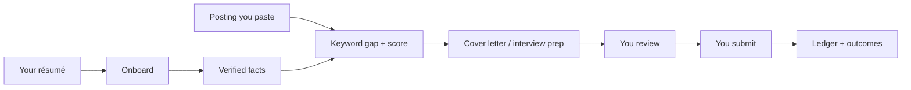

<p align="center">
  <strong>jobbie</strong><br>
  <sub>Privacy-first Agent Skill + CLI for evidence-based job applications</sub>
</p>

<p align="center">
  <a href="https://www.npmjs.com/package/jobbie"></a>
  <a href="https://www.npmjs.com/package/jobbie"></a>
  <a href="LICENSE"></a>
  <a href="https://github.com/zohaib-md/jobbie/releases/tag/v0.1.0"></a>
</p>

<p align="center">
  Onboard a résumé · Check keyword gaps · Draft truthful materials · Track outcomes<br>
  <em>Verified facts only. Private data stays on your machine. You confirm every submit.</em>
</p>

---

jobbie is a local **Agent Skill** and **CLI** for your own job search. It extracts sourced facts from a résumé you provide, compares them to a posting you paste, drafts cover letters and interview prep from those facts, and keeps a ledger of what you actually submitted.

It does not search a job board, auto-submit applications, solve CAPTCHA or MFA, or invent experience.

```bash
npx jobbie@latest install
```

Then, in Cursor (or another coding agent that supports Agent Skills), with a local résumé and a pasted job description:

```text
Use jobbie to onboard my resume and run a keyword-gap check against this job description.
```

Requires **Node.js 20+**. Zero runtime dependencies.

## Why jobbie

| You want | jobbie does |
| --- | --- |
| Help applying without leaking a résumé to a SaaS | Profile in Keychain / `~/.jobbie/`. Telemetry **off** by default. |
| Answers that match the résumé | Facts are sourced. Missing fields return `needs-user-input`, not a guess. |
| A ranking of jobs you already found | You supply `{ company, role, url }`. Nothing is scraped around a login wall. |
| Prepare, then you hit submit | Packets can be `prepared`. `submitted` is recorded only after visible confirmation. |

## First ten minutes

**1. Install the skill**

```bash
npx jobbie@latest install
npx jobbie@latest status
```

The skill lands at `~/.agents/skills/jobbie`, and at `~/.cursor/skills/jobbie` when that folder exists.

**2. Onboard a résumé**

Prefer `.txt` or `.md`. DOCX and simple (uncompressed) PDFs work. Scanned PDFs need a text extract — jobbie will not OCR.

```bash
npx jobbie onboard --resume ./resume.txt
```

It will pause for target role, seniority, and work authorization. Fill those in; do not let an agent invent them.

**3. Keyword-gap a posting**

```bash
printf '%s' '{"jobDescription":"PASTE THE JOB DESCRIPTION HERE"}' | npx jobbie ats analyze --stdin
```

Or in chat:

```text
ats analyze this posting
```

## How a session runs



Hard stops along the way: login / SSO / MFA, CAPTCHA, legal attestations, demographics, government IDs, and anything that cannot be verified from the profile or résumé.

## What you can say in chat

```text
onboard this resume
ats analyze this posting
rank these job listings
apply https://company.example/jobs/123
draft a cover letter for this role
prep me for this interview
record outcome Acme — Senior Engineer — interview
```

Submission modes:

- `review-each` — inspect every application (default)
- `routine-auto` — prepare an authorized batch; **each actual submission still needs your confirmation**

`autoEligible: true` only means a posting passed local gates. It is never permission to submit.

## CLI

Installer:

```bash
npx jobbie@latest install
npx jobbie@latest status
npx jobbie@latest update
npx jobbie@latest updates disable
npx jobbie@latest updates enable
```

Day to day:

```bash
npx jobbie onboard --resume ./resume.txt
npx jobbie ats analyze --stdin
npx jobbie discover search --stdin < listings.json
npx jobbie cover-letter draft --stdin
npx jobbie prep generate --stdin
npx jobbie safety classify --stdin
npx jobbie ledger review
```

Same commands after install, from the skill copy:

```bash
node ~/.agents/skills/jobbie/scripts/jobbie.mjs onboard --resume ./resume.txt
```

`discover search` ranks JSON **you already collected**. Each listing needs `company`, `role`, and `url`.

```json
{
  "query": "senior engineer",
  "listings": [
    {
      "company": "Example Cloud Co",
      "role": "Senior Engineer",
      "url": "https://jobs.example.com/123"
    }
  ]
}
```

## Privacy

| Data | Where it lives |
| --- | --- |
| Candidate profile | macOS Keychain, or encrypted `~/.jobbie/profile.enc` |
| Canonical résumé and facts | `~/.jobbie/` (`resume.txt`, `facts.json`) |
| Application ledger | `~/.jobbie/applications.ndjson`, `outcomes.ndjson` |
| Browser login | Your existing browser session only |

Override the data directory with `JOBBIE_HOME`. jobbie does not read cookies, local storage, or session files.

Telemetry is **off**. If you run `telemetry enable`, previews are local only and limited to `event`, `stage`, `atsPlatform`, `seniority`, `fitScore`, and `outcome`. Résumé text, email, phone, and names are stripped. There is no network relay. Disable with `telemetry disable`.

## Safety

jobbie pauses for passwords, SSO, MFA, CAPTCHA, demographic questions, legal attestations, government identifiers, and unclear work authorization, sponsorship, location, or compensation.

It never:

- enters an MFA code or solves a CAPTCHA
- bypasses bot detection
- fabricates résumé facts, dates, titles, or salary
- records `submitted` without `visibleConfirmation: true`

## Limitations

- No interviews, offers, eligibility, or “the form was filled correctly” are guaranteed.
- No built-in job board. Listings without `company`, `role`, and `url` are rejected.
- No silent submit. CAPTCHA, MFA, and bot checks are hard stops.
- Missing facts are not invented.
- PDF import is **text-based**. Image-only scans need a local `.txt` or `.md`.
- You are responsible for reviewing claims and for platform terms of use.
- This is an MIT-licensed side project, not a company or a placement service.

## Develop

```bash
git clone https://github.com/zohaib-md/jobbie.git
cd jobbie
npm test
npm run check
```

See [CONTRIBUTING.md](CONTRIBUTING.md). Starter issues: [GOOD_FIRST_ISSUES.md](GOOD_FIRST_ISSUES.md).

## Acknowledgements

jobbie is derived from [Applykit](https://github.com/manthan-jsharma/apply-kit-npm) 1.0.0 by Manthan Sharma (`manthan.jsharma@gmail.com`). The original skill, installer, scoring, and local-store design are that work.

This repository adds, on top of that base:

- local DOCX and simple PDF text import (no OCR)
- tested safety pauses for MFA, CAPTCHA, legal attestations, and unverifiable answers
- sourced résumé facts that refuse to guess missing fields
- a ledger that records `submitted` only after visible confirmation

Do not treat jobbie as a from-scratch rewrite of Applykit.

## License

MIT. See [LICENSE](LICENSE).

Copyright (c) 2026 Applykit Contributors  
Copyright (c) 2026 Mohammad Zohaib
